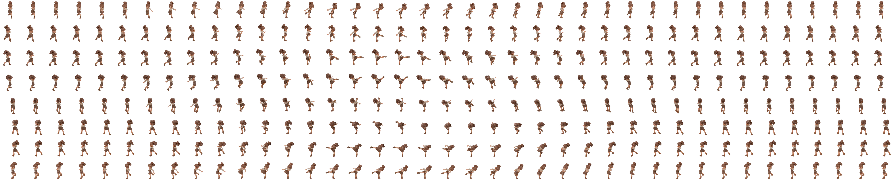
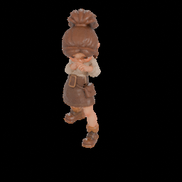
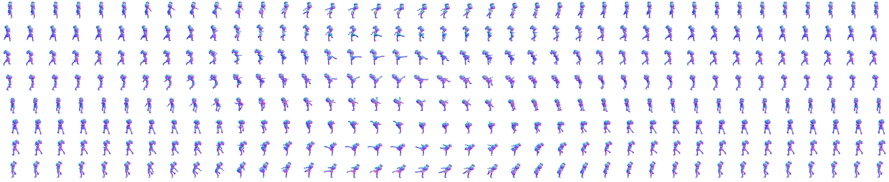

# comfyui-iso-sprite

Turn a rigged, animated 3D character into an **isometric 8-direction sprite atlas**
inside ComfyUI. Blender (`bpy`) does the rendering in a subprocess; ComfyUI gets
back an IMAGE batch, a packed atlas sheet, and the numbers it needs to play the
result back at the clip's original speed.

Built to sit at the end of a [ComfyUI-UniRig](https://github.com/Comfy-Org/ComfyUI-UniRig)
pipeline: mesh → auto-rig → apply animation → **sprite atlas**.



*8 directions × 39 frames off a single 1.6 s clip. Rows are directions.*





*The same 8 × 39 cells with `render_normals` on: a view-space normal map baked
from the real geometry, cell-for-cell aligned with the colour sheet.*

## Nodes

### `Iso Sprite Atlas Render` (`IsoSpriteSheetRender`)

Renders an animated FBX/GLB from N evenly spaced camera angles across the whole
animation and packs the cells into one sheet.

| input | default | notes |
| --- | --- | --- |
| `mesh_path` | — | animated rigged FBX/GLB. Wire `UniRig: Apply Animation`'s `animated_fbx_path` here. |
| `directions` | 8 | cameras spread evenly over 360°. 8 = classic isometric 8-way. |
| `frames` | 8 | animation frames sampled evenly across the clip. Total renders = `directions × frames`. |
| `cell_width` / `cell_height` | 256 | per-sprite size. |
| `elevation` | 30 | camera pitch. 30 = game isometric, 35.264 = true dimetric. |
| `start_azimuth` | 0 | yaw of direction 0. 0 = character faces the camera. |
| `clockwise` | true | direction order S, SW, W, NW, N, NE, E, SE. |
| `zoom` | 1.3 | ortho frame size relative to the subject. |
| `engine` | CYCLES | `BLENDER_EEVEE_NEXT` is a legacy alias of `BLENDER_EEVEE`, kept so older workflows still load. |
| `samples` | 24 | Cycles CPU samples per cell. |
| `transparent` | true | alpha background for the atlas PNG. |
| `layout` | rows=direction | atlas orientation. |
| `frame_start` / `frame_end` | -1 | -1 = use the clip's own range. |
| `include_last` | false | off = drop the duplicate final frame so a cycle tiles cleanly. |
| `render_normals` | false | also render a matching view-space normal-map set and sheet. Roughly doubles render time. |
| `supersample` | 2 | render each cell N× larger and average it back down. The biggest quality win on small sprites; ~3.5× the render time. |
| `view_transform` | Standard | tone mapping. Blender's own default is AgX, which desaturates on purpose and reads muddy on character art. |
| `ambient_strength` / `ambient_color` | 0.65 / cool grey | environment light, now independent of `bg_color`. |
| `key_strength` / `fill_strength` / `rim_strength` | 5.5 / 1.2 / 5.0 | the three suns. `rim` is the backlight that pops the silhouette. |
| `sun_softness` | 6 | angular size of the suns in degrees. 0 = razor-hard shadows. |
| `ground_shadow` | false | shadow-catcher floor, so the character casts a contact shadow into the cell's alpha instead of floating. Cycles only. |

Outputs: `images` (flat batch, direction-major), `masks`, `atlas` (the sheet),
`atlas_path`, `report` (JSON: sampled frames, clip range, sheet size), plus
`normals`, `normal_atlas` and `normal_atlas_path` when `render_normals` is on.

**One camera per direction, sized to the union bounding box of every sampled
frame** — the character does not swim or rescale between cells.

### Lighting

A **world-fixed** three-point rig: a warm key from the front-left, a cool fill
opposite it, and a cool rim backlight for silhouette separation. The lights
deliberately do *not* follow the camera — in an isometric game every sprite
shares one sun, and a camera-locked rig reads as that sun spinning with the
character. The trade is that back-facing directions are lit from behind, which
is exactly what the game wants.

The world contributes **ambient light only**. It used to be driven by
`bg_color` at full strength, which meant picking a light backdrop silently
washed the shading flat; the backdrop is now composited after the render and
cannot touch the lighting.

Measured on an 8 × 39 sheet, the current defaults hold the old average
brightness (luma 105 vs 108) while widening the tonal range by ~29 %
(111 vs 86, 5th-95th percentile).

### `Anim Clip Frame Count` (`AnimClipFrameCount`)

Reads the clip's real frame range and frame rate, then answers "how many sprite
frames, played at what fps". Without it, an 8-frame sheet of a 1.6 s clip played
at a guessed 12 fps runs ~2.4× too fast.

| input | default | notes |
| --- | --- | --- |
| `mesh_path` | — | same animated FBX/GLB. |
| `mode` | target_fps | `target_fps` / `every_nth_frame` / `all_frames`. |
| `target_fps` | 12 | sprite frames per second of clip. 10–15 is the usual game range. |
| `min_frames` / `max_frames` | 4 / 24 | `max_frames` is your render-time budget. |
| `speed` | 1.0 | playback multiplier; 1.0 = original speed. |
| `source_fps_override` | 0 | 0 = read from the file. Set 30 for Mixamo clips that import at the wrong rate. |

Outputs: `frames`, `playback_fps`, `frame_start`, `frame_end`, `duration_sec`, `report`.

Wire `frames` → `Iso Sprite Atlas Render.frames` and `playback_fps` →
`SaveAnimatedWEBP.fps`.

### `Pose Render (random pose -> IMAGE)` (`PoseRandomRender`)

Single still: import a rigged FBX/GLB, apply a seeded random humanoid pose,
render it. Useful for dataset generation and for eyeballing a rig.

## Requirements

A python that owns `bpy`. Installing
[ComfyUI-UniRig](https://github.com/Comfy-Org/ComfyUI-UniRig) provisions one and
these nodes find it automatically; otherwise point `POSE_RENDER_PYTHON` at a
python with `bpy` installed:

```bash
export POSE_RENDER_PYTHON=/path/to/python-with-bpy
```

Nothing runs in ComfyUI's own interpreter except argument marshalling and image
packing, so `bpy` never has to be compatible with ComfyUI's torch.

## Typical graph

```
Load3D → Hy3DLoadMesh → MIA: Auto Rig → UniRig: Apply Animation
                                              ├→ Anim Clip Frame Count ─┐
                                              └→ Iso Sprite Atlas Render ┤
                                                     ├ atlas  → PreviewImage / SaveImage
                                                     └ images → Get Image from Batch → SaveAnimatedWEBP
```

`Get Image from Batch` with `batch_index = direction × frames` and
`length = frames` pulls a single direction out for a looping preview.

## Notes

- `SaveAnimatedWEBP` drops alpha, so a `transparent` render previews on black.
  Turn `transparent` off and set `bg_color` if you want a filled background.
- Render cost is `directions × frames` cells. On a small character at 256 px /
  24 samples this is roughly 0.15 s per cell on CPU, ~0.55 s at `supersample 2`.
- Cycles denoising is left off: the bundled `bpy` cannot create an OIDN device,
  and enabling it fails the render rather than degrading it.
- The atlas PNG is written to ComfyUI's output directory via `filename_prefix`;
  `atlas_path` returns where it landed.
- `render_normals` renders a second pass through a Blender material override, so
  the normals are the true shading normals, not an image-space estimate of them.
  They are **view-space, OpenGL convention** — R = +X right, G = +Y up, B = +Z
  toward the camera — which is what a 2D sprite lighting shader expects. The
  normal sheet uses the same directions, frames and layout as the colour sheet
  and is written next to it as `<filename_prefix>_normal`.

## License

MIT
